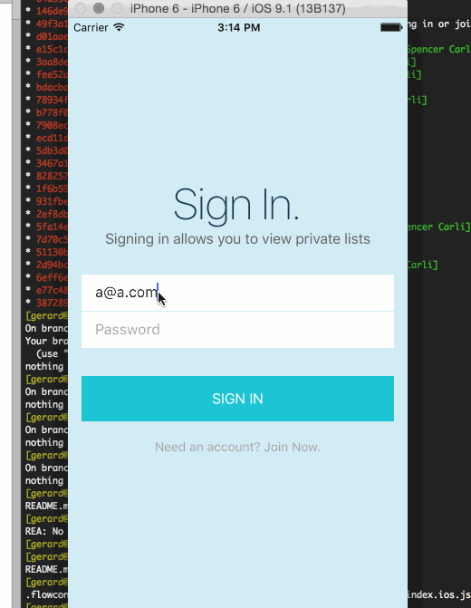

# Differential Parking App

A demo of React Native interacting with a Meteor backend.

## Installation

1. [Install Meteor](https://www.meteor.com/install)
2. [Install React Native](https://facebook.github.io/react-native/docs/getting-started.html) (Only works on OSX currently)

## Running

You'll need two terminal windows to run this example.

1. In terminal window 1 run `cd meteor-app/ && meteor`
2. In terminal window 2 run `cd ReactNativeTodos/ && npm install && npm run app`
3. After the npm dependencies are installed Xcode should open. You can then press the play button in the top left of Xcode and the iOS simulator should open.

